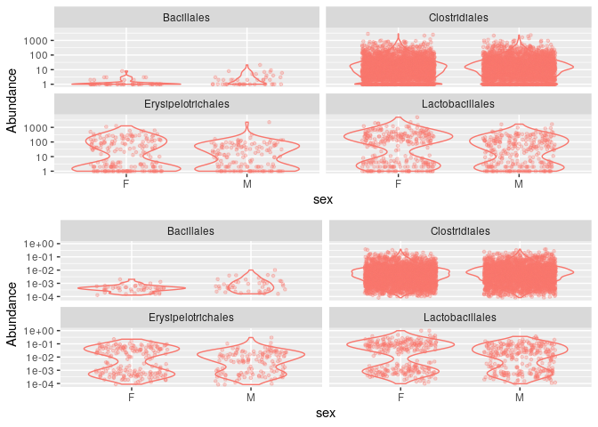
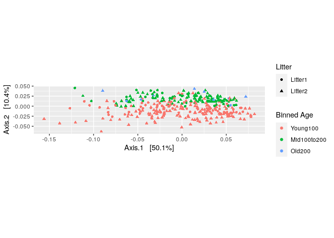
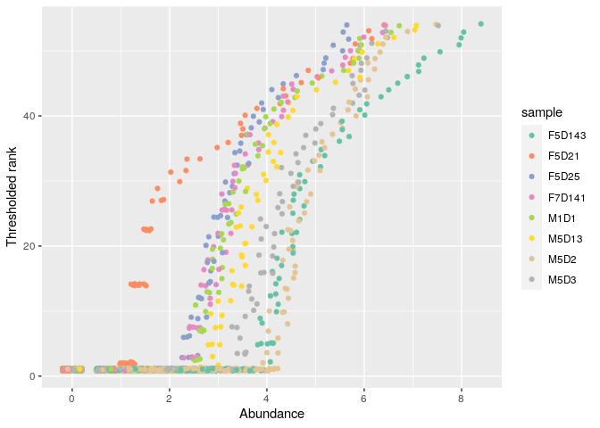
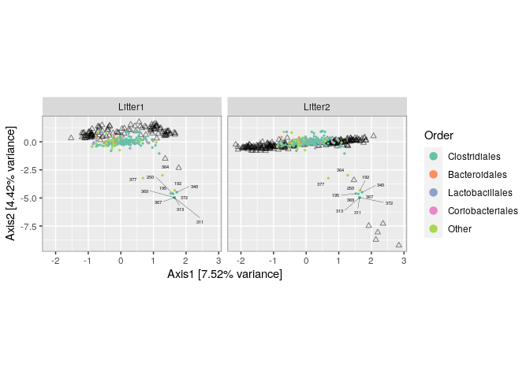
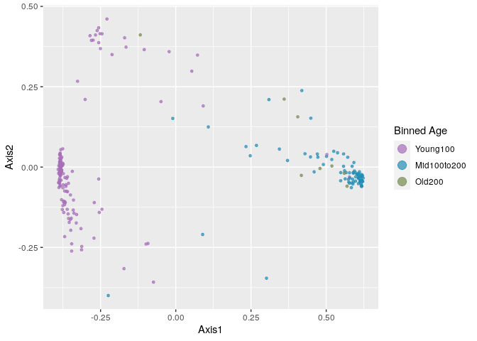
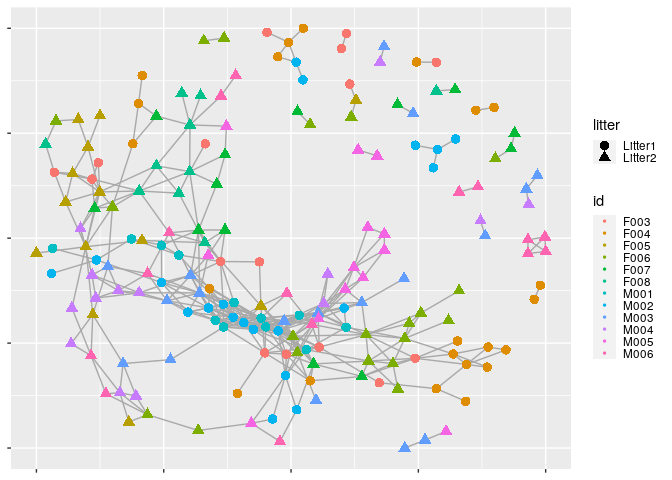
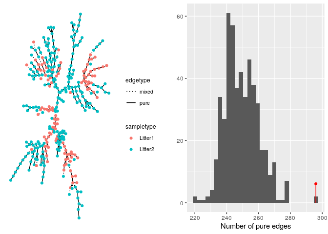
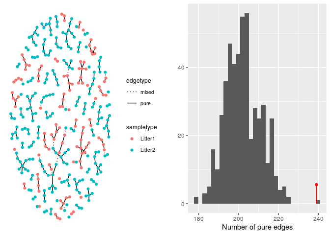

metabarcoding with dada2: environment installation
================

  - [Introduction.](#introduction.)
      - [Installation des packages.](#installation-des-packages.)
      - [Importation des données.](#importation-des-données.)
  - [Filtration et réduction des
    données.](#filtration-et-réduction-des-données.)
  - [Infer sequence variants](#infer-sequence-variants)
  - [Construct sequence table and remove
    chimeras.](#construct-sequence-table-and-remove-chimeras.)
      - [Construction de la table.](#construction-de-la-table.)
      - [Supression des chimères.](#supression-des-chimères.)
  - [Assignation de la taxonomie.](#assignation-de-la-taxonomie.)
  - [installation de vegan dnas les install
    packages](#installation-de-vegan-dnas-les-install-packages)

# Introduction.

## Installation des packages.

Tout les packages seront installés dnas un script à part
(00\_package-install.Rmd)

## Importation des données.

Les données utilisées pour nos analyses ont été obtenue par Illumina
Miseq 2x250 amplicon de la séquence V4 du 16S (Kozich et al. 2013). Ils
proviennent de 360 échantillons fécaux collectés de 12 souries dnas leur
première année de vie These 360 fecal samples were collected from 12
mice longitudinally over the first year of life one mock community
control. These were collected to investigate the development and
stabilization of the murine microbiome (Schloss et al. 2012). These data
are downloaded from the following data location and unzip. For now just
consider them paired-end fastq files to be processed. Define the
following path variable so that it points to the extracted directory on
your machine:

L’importation des données sera réalisée dans un script à part
(01\_data-import.Rmd)

Après avoir dezippé les données, on va les associer à une variable.

``` r
miseq_path <- "./MiSeq_SOP" # CHANGE to the directory containing the fastq files after unzipping.
list.files(miseq_path)
```

    ##  [1] "F3D0_S188_L001_R1_001.fastq"   "F3D0_S188_L001_R2_001.fastq"  
    ##  [3] "F3D1_S189_L001_R1_001.fastq"   "F3D1_S189_L001_R2_001.fastq"  
    ##  [5] "F3D141_S207_L001_R1_001.fastq" "F3D141_S207_L001_R2_001.fastq"
    ##  [7] "F3D142_S208_L001_R1_001.fastq" "F3D142_S208_L001_R2_001.fastq"
    ##  [9] "F3D143_S209_L001_R1_001.fastq" "F3D143_S209_L001_R2_001.fastq"
    ## [11] "F3D144_S210_L001_R1_001.fastq" "F3D144_S210_L001_R2_001.fastq"
    ## [13] "F3D145_S211_L001_R1_001.fastq" "F3D145_S211_L001_R2_001.fastq"
    ## [15] "F3D146_S212_L001_R1_001.fastq" "F3D146_S212_L001_R2_001.fastq"
    ## [17] "F3D147_S213_L001_R1_001.fastq" "F3D147_S213_L001_R2_001.fastq"
    ## [19] "F3D148_S214_L001_R1_001.fastq" "F3D148_S214_L001_R2_001.fastq"
    ## [21] "F3D149_S215_L001_R1_001.fastq" "F3D149_S215_L001_R2_001.fastq"
    ## [23] "F3D150_S216_L001_R1_001.fastq" "F3D150_S216_L001_R2_001.fastq"
    ## [25] "F3D2_S190_L001_R1_001.fastq"   "F3D2_S190_L001_R2_001.fastq"  
    ## [27] "F3D3_S191_L001_R1_001.fastq"   "F3D3_S191_L001_R2_001.fastq"  
    ## [29] "F3D5_S193_L001_R1_001.fastq"   "F3D5_S193_L001_R2_001.fastq"  
    ## [31] "F3D6_S194_L001_R1_001.fastq"   "F3D6_S194_L001_R2_001.fastq"  
    ## [33] "F3D7_S195_L001_R1_001.fastq"   "F3D7_S195_L001_R2_001.fastq"  
    ## [35] "F3D8_S196_L001_R1_001.fastq"   "F3D8_S196_L001_R2_001.fastq"  
    ## [37] "F3D9_S197_L001_R1_001.fastq"   "F3D9_S197_L001_R2_001.fastq"  
    ## [39] "filtered"                      "HMP_MOCK.v35.fasta"           
    ## [41] "Mock_S280_L001_R1_001.fastq"   "Mock_S280_L001_R2_001.fastq"  
    ## [43] "mouse.dpw.metadata"            "mouse.time.design"            
    ## [45] "stability.batch"               "stability.files"

# Filtration et réduction des données.

Dans cette partie, nous allons retirer les reads de mauvaise qualité et
réduire les autres pour qu’ils aient une longueur constante.

Premièrement, on va lire les fichiers de fastq et créer des listes que
l’on va associer à des variables: -\> Variable fnFs pour les fowards.
-\> Variable fnRs pour les reverses.

``` r
# Sort ensures forward/reverse reads are in same order
fnFs <- sort(list.files(miseq_path, pattern="_R1_001.fastq"))
fnRs <- sort(list.files(miseq_path, pattern="_R2_001.fastq"))
# Extract sample names, assuming filenames have format: SAMPLENAME_XXX.fastq
sampleNames <- sapply(strsplit(fnFs, "_"), `[`, 1)
# Specify the full path to the fnFs and fnRs
fnFs <- file.path(miseq_path, fnFs)
fnRs <- file.path(miseq_path, fnRs)
fnFs[1:3]
```

    ## [1] "./MiSeq_SOP/F3D0_S188_L001_R1_001.fastq"  
    ## [2] "./MiSeq_SOP/F3D1_S189_L001_R1_001.fastq"  
    ## [3] "./MiSeq_SOP/F3D141_S207_L001_R1_001.fastq"

``` r
fnRs[1:3]
```

    ## [1] "./MiSeq_SOP/F3D0_S188_L001_R2_001.fastq"  
    ## [2] "./MiSeq_SOP/F3D1_S189_L001_R2_001.fastq"  
    ## [3] "./MiSeq_SOP/F3D141_S207_L001_R2_001.fastq"

Quand on séquence en utilisant la méthode Illumina, on va avoir une
baisse de qualité à la fin du séquençage des reads On peux voir cela sur
les graphiques suivants (pour les deux premiers fowards et reverses):

``` r
library(ggplot2)
library(dada2)
```

    ## Loading required package: Rcpp

``` r
plotQualityProfile(fnFs[1:2])
```

<!-- -->

On remarque une baisse du Qscore lors des cycles, mais c’est après 240
cycles que ce score va passer en dessous de 30 (valeur limite concensus)

``` r
plotQualityProfile(fnRs[1:2])
```

<!-- -->

Le Qscore des reverses baisse beaucoup plus rapidement que pour les
fowards. Il passe en dessous de 30 après seulement 160 cycles.

``` r
filt_path <- file.path(miseq_path, "filtered") # Place filtered files in filtered/ subdirectory
if(!file_test("-d", filt_path)) dir.create(filt_path)
filtFs <- file.path(filt_path, paste0(sampleNames, "_F_filt.fastq.gz"))
filtRs <- file.path(filt_path, paste0(sampleNames, "_R_filt.fastq.gz"))
```

Quand on filtre et réduit (filter and trim), le foward et reverse
associé doivent tous les deux passer la ‘sélection’ pour être gardé

Filter the forward and reverse reads:

``` r
out <- filterAndTrim(fnFs, filtFs, fnRs, filtRs, truncLen=c(240,160),
              maxN=0, maxEE=c(2,2), truncQ=2, rm.phix=TRUE,
              compress=TRUE, multithread=TRUE) # On Windows set multithread=FALSE
head(out)
```

    ##                               reads.in reads.out
    ## F3D0_S188_L001_R1_001.fastq       7793      7113
    ## F3D1_S189_L001_R1_001.fastq       5869      5299
    ## F3D141_S207_L001_R1_001.fastq     5958      5463
    ## F3D142_S208_L001_R1_001.fastq     3183      2914
    ## F3D143_S209_L001_R1_001.fastq     3178      2941
    ## F3D144_S210_L001_R1_001.fastq     4827      4312

# Infer sequence variants

\#\#Dereplication

``` r
derepFs <- derepFastq(filtFs, verbose=TRUE)
```

    ## Dereplicating sequence entries in Fastq file: ./MiSeq_SOP/filtered/F3D0_F_filt.fastq.gz

    ## Encountered 1979 unique sequences from 7113 total sequences read.

    ## Dereplicating sequence entries in Fastq file: ./MiSeq_SOP/filtered/F3D1_F_filt.fastq.gz

    ## Encountered 1639 unique sequences from 5299 total sequences read.

    ## Dereplicating sequence entries in Fastq file: ./MiSeq_SOP/filtered/F3D141_F_filt.fastq.gz

    ## Encountered 1477 unique sequences from 5463 total sequences read.

    ## Dereplicating sequence entries in Fastq file: ./MiSeq_SOP/filtered/F3D142_F_filt.fastq.gz

    ## Encountered 904 unique sequences from 2914 total sequences read.

    ## Dereplicating sequence entries in Fastq file: ./MiSeq_SOP/filtered/F3D143_F_filt.fastq.gz

    ## Encountered 939 unique sequences from 2941 total sequences read.

    ## Dereplicating sequence entries in Fastq file: ./MiSeq_SOP/filtered/F3D144_F_filt.fastq.gz

    ## Encountered 1267 unique sequences from 4312 total sequences read.

    ## Dereplicating sequence entries in Fastq file: ./MiSeq_SOP/filtered/F3D145_F_filt.fastq.gz

    ## Encountered 1756 unique sequences from 6741 total sequences read.

    ## Dereplicating sequence entries in Fastq file: ./MiSeq_SOP/filtered/F3D146_F_filt.fastq.gz

    ## Encountered 1438 unique sequences from 4560 total sequences read.

    ## Dereplicating sequence entries in Fastq file: ./MiSeq_SOP/filtered/F3D147_F_filt.fastq.gz

    ## Encountered 3590 unique sequences from 15637 total sequences read.

    ## Dereplicating sequence entries in Fastq file: ./MiSeq_SOP/filtered/F3D148_F_filt.fastq.gz

    ## Encountered 2762 unique sequences from 11413 total sequences read.

    ## Dereplicating sequence entries in Fastq file: ./MiSeq_SOP/filtered/F3D149_F_filt.fastq.gz

    ## Encountered 3021 unique sequences from 12017 total sequences read.

    ## Dereplicating sequence entries in Fastq file: ./MiSeq_SOP/filtered/F3D150_F_filt.fastq.gz

    ## Encountered 1566 unique sequences from 5032 total sequences read.

    ## Dereplicating sequence entries in Fastq file: ./MiSeq_SOP/filtered/F3D2_F_filt.fastq.gz

    ## Encountered 3707 unique sequences from 18075 total sequences read.

    ## Dereplicating sequence entries in Fastq file: ./MiSeq_SOP/filtered/F3D3_F_filt.fastq.gz

    ## Encountered 1479 unique sequences from 6250 total sequences read.

    ## Dereplicating sequence entries in Fastq file: ./MiSeq_SOP/filtered/F3D5_F_filt.fastq.gz

    ## Encountered 1195 unique sequences from 4052 total sequences read.

    ## Dereplicating sequence entries in Fastq file: ./MiSeq_SOP/filtered/F3D6_F_filt.fastq.gz

    ## Encountered 1832 unique sequences from 7369 total sequences read.

    ## Dereplicating sequence entries in Fastq file: ./MiSeq_SOP/filtered/F3D7_F_filt.fastq.gz

    ## Encountered 1183 unique sequences from 4765 total sequences read.

    ## Dereplicating sequence entries in Fastq file: ./MiSeq_SOP/filtered/F3D8_F_filt.fastq.gz

    ## Encountered 1382 unique sequences from 4871 total sequences read.

    ## Dereplicating sequence entries in Fastq file: ./MiSeq_SOP/filtered/F3D9_F_filt.fastq.gz

    ## Encountered 1709 unique sequences from 6504 total sequences read.

    ## Dereplicating sequence entries in Fastq file: ./MiSeq_SOP/filtered/Mock_F_filt.fastq.gz

    ## Encountered 897 unique sequences from 4314 total sequences read.

``` r
derepRs <- derepFastq(filtRs, verbose=TRUE)
```

    ## Dereplicating sequence entries in Fastq file: ./MiSeq_SOP/filtered/F3D0_R_filt.fastq.gz

    ## Encountered 1660 unique sequences from 7113 total sequences read.

    ## Dereplicating sequence entries in Fastq file: ./MiSeq_SOP/filtered/F3D1_R_filt.fastq.gz

    ## Encountered 1349 unique sequences from 5299 total sequences read.

    ## Dereplicating sequence entries in Fastq file: ./MiSeq_SOP/filtered/F3D141_R_filt.fastq.gz

    ## Encountered 1335 unique sequences from 5463 total sequences read.

    ## Dereplicating sequence entries in Fastq file: ./MiSeq_SOP/filtered/F3D142_R_filt.fastq.gz

    ## Encountered 853 unique sequences from 2914 total sequences read.

    ## Dereplicating sequence entries in Fastq file: ./MiSeq_SOP/filtered/F3D143_R_filt.fastq.gz

    ## Encountered 880 unique sequences from 2941 total sequences read.

    ## Dereplicating sequence entries in Fastq file: ./MiSeq_SOP/filtered/F3D144_R_filt.fastq.gz

    ## Encountered 1286 unique sequences from 4312 total sequences read.

    ## Dereplicating sequence entries in Fastq file: ./MiSeq_SOP/filtered/F3D145_R_filt.fastq.gz

    ## Encountered 1803 unique sequences from 6741 total sequences read.

    ## Dereplicating sequence entries in Fastq file: ./MiSeq_SOP/filtered/F3D146_R_filt.fastq.gz

    ## Encountered 1265 unique sequences from 4560 total sequences read.

    ## Dereplicating sequence entries in Fastq file: ./MiSeq_SOP/filtered/F3D147_R_filt.fastq.gz

    ## Encountered 3414 unique sequences from 15637 total sequences read.

    ## Dereplicating sequence entries in Fastq file: ./MiSeq_SOP/filtered/F3D148_R_filt.fastq.gz

    ## Encountered 2522 unique sequences from 11413 total sequences read.

    ## Dereplicating sequence entries in Fastq file: ./MiSeq_SOP/filtered/F3D149_R_filt.fastq.gz

    ## Encountered 2771 unique sequences from 12017 total sequences read.

    ## Dereplicating sequence entries in Fastq file: ./MiSeq_SOP/filtered/F3D150_R_filt.fastq.gz

    ## Encountered 1415 unique sequences from 5032 total sequences read.

    ## Dereplicating sequence entries in Fastq file: ./MiSeq_SOP/filtered/F3D2_R_filt.fastq.gz

    ## Encountered 3290 unique sequences from 18075 total sequences read.

    ## Dereplicating sequence entries in Fastq file: ./MiSeq_SOP/filtered/F3D3_R_filt.fastq.gz

    ## Encountered 1390 unique sequences from 6250 total sequences read.

    ## Dereplicating sequence entries in Fastq file: ./MiSeq_SOP/filtered/F3D5_R_filt.fastq.gz

    ## Encountered 1134 unique sequences from 4052 total sequences read.

    ## Dereplicating sequence entries in Fastq file: ./MiSeq_SOP/filtered/F3D6_R_filt.fastq.gz

    ## Encountered 1635 unique sequences from 7369 total sequences read.

    ## Dereplicating sequence entries in Fastq file: ./MiSeq_SOP/filtered/F3D7_R_filt.fastq.gz

    ## Encountered 1084 unique sequences from 4765 total sequences read.

    ## Dereplicating sequence entries in Fastq file: ./MiSeq_SOP/filtered/F3D8_R_filt.fastq.gz

    ## Encountered 1161 unique sequences from 4871 total sequences read.

    ## Dereplicating sequence entries in Fastq file: ./MiSeq_SOP/filtered/F3D9_R_filt.fastq.gz

    ## Encountered 1502 unique sequences from 6504 total sequences read.

    ## Dereplicating sequence entries in Fastq file: ./MiSeq_SOP/filtered/Mock_R_filt.fastq.gz

    ## Encountered 732 unique sequences from 4314 total sequences read.

``` r
# Name the derep-class objects by the sample names
names(derepFs) <- sampleNames
names(derepRs) <- sampleNames
```

méthode DADA2: pour différentier les variants et les erreurs de
séquençage

``` r
errF <- learnErrors(filtFs, multithread=TRUE)
```

    ## 33514080 total bases in 139642 reads from 20 samples will be used for learning the error rates.

``` r
errR <- learnErrors(filtRs, multithread=TRUE)
```

    ## 22342720 total bases in 139642 reads from 20 samples will be used for learning the error rates.

``` r
plotErrors(errF)
```

    ## Warning: Transformation introduced infinite values in continuous y-axis

<!-- -->

``` r
plotErrors(errR)
```

    ## Warning: Transformation introduced infinite values in continuous y-axis

<!-- -->

``` r
dadaFs <- dada(derepFs, err=errF, multithread=TRUE)
```

    ## Sample 1 - 7113 reads in 1979 unique sequences.
    ## Sample 2 - 5299 reads in 1639 unique sequences.
    ## Sample 3 - 5463 reads in 1477 unique sequences.
    ## Sample 4 - 2914 reads in 904 unique sequences.
    ## Sample 5 - 2941 reads in 939 unique sequences.
    ## Sample 6 - 4312 reads in 1267 unique sequences.
    ## Sample 7 - 6741 reads in 1756 unique sequences.
    ## Sample 8 - 4560 reads in 1438 unique sequences.
    ## Sample 9 - 15637 reads in 3590 unique sequences.
    ## Sample 10 - 11413 reads in 2762 unique sequences.
    ## Sample 11 - 12017 reads in 3021 unique sequences.
    ## Sample 12 - 5032 reads in 1566 unique sequences.
    ## Sample 13 - 18075 reads in 3707 unique sequences.
    ## Sample 14 - 6250 reads in 1479 unique sequences.
    ## Sample 15 - 4052 reads in 1195 unique sequences.
    ## Sample 16 - 7369 reads in 1832 unique sequences.
    ## Sample 17 - 4765 reads in 1183 unique sequences.
    ## Sample 18 - 4871 reads in 1382 unique sequences.
    ## Sample 19 - 6504 reads in 1709 unique sequences.
    ## Sample 20 - 4314 reads in 897 unique sequences.

``` r
dadaRs <- dada(derepRs, err=errR, multithread=TRUE)
```

    ## Sample 1 - 7113 reads in 1660 unique sequences.
    ## Sample 2 - 5299 reads in 1349 unique sequences.
    ## Sample 3 - 5463 reads in 1335 unique sequences.
    ## Sample 4 - 2914 reads in 853 unique sequences.
    ## Sample 5 - 2941 reads in 880 unique sequences.
    ## Sample 6 - 4312 reads in 1286 unique sequences.
    ## Sample 7 - 6741 reads in 1803 unique sequences.
    ## Sample 8 - 4560 reads in 1265 unique sequences.
    ## Sample 9 - 15637 reads in 3414 unique sequences.
    ## Sample 10 - 11413 reads in 2522 unique sequences.
    ## Sample 11 - 12017 reads in 2771 unique sequences.
    ## Sample 12 - 5032 reads in 1415 unique sequences.
    ## Sample 13 - 18075 reads in 3290 unique sequences.
    ## Sample 14 - 6250 reads in 1390 unique sequences.
    ## Sample 15 - 4052 reads in 1134 unique sequences.
    ## Sample 16 - 7369 reads in 1635 unique sequences.
    ## Sample 17 - 4765 reads in 1084 unique sequences.
    ## Sample 18 - 4871 reads in 1161 unique sequences.
    ## Sample 19 - 6504 reads in 1502 unique sequences.
    ## Sample 20 - 4314 reads in 732 unique sequences.

Inspecting the dada-class object returned by dada:

``` r
dadaFs[[1]]
```

    ## dada-class: object describing DADA2 denoising results
    ## 128 sequence variants were inferred from 1979 input unique sequences.
    ## Key parameters: OMEGA_A = 1e-40, OMEGA_C = 1e-40, BAND_SIZE = 16

# Construct sequence table and remove chimeras.

## Construction de la table.

``` r
mergers <- mergePairs(dadaFs, derepFs, dadaRs, derepRs)
```

``` r
seqtabAll <- makeSequenceTable(mergers[!grepl("Mock", names(mergers))])
table(nchar(getSequences(seqtabAll)))
```

    ## 
    ## 251 252 253 254 255 
    ##   1  85 186   5   2

## Supression des chimères.

Comparaison de chaque séquences de la table entre-elles pour éliminer
celles qui serai le résultat de deux autres plus abondante.

``` r
seqtabNoC <- removeBimeraDenovo(seqtabAll)
```

# Assignation de la taxonomie.

``` r
library(dada2)
fastaRef <- "~/silva_nr99_v138_train_set.fa.gz"
taxTab <- assignTaxonomy(seqtabNoC, refFasta = fastaRef, multithread=TRUE)
unname(head(taxTab))
```

    ##      [,1]       [,2]           [,3]          [,4]            [,5]            
    ## [1,] "Bacteria" "Bacteroidota" "Bacteroidia" "Bacteroidales" "Muribaculaceae"
    ## [2,] "Bacteria" "Bacteroidota" "Bacteroidia" "Bacteroidales" "Muribaculaceae"
    ## [3,] "Bacteria" "Bacteroidota" "Bacteroidia" "Bacteroidales" "Muribaculaceae"
    ## [4,] "Bacteria" "Bacteroidota" "Bacteroidia" "Bacteroidales" "Muribaculaceae"
    ## [5,] "Bacteria" "Bacteroidota" "Bacteroidia" "Bacteroidales" "Bacteroidaceae"
    ## [6,] "Bacteria" "Bacteroidota" "Bacteroidia" "Bacteroidales" "Muribaculaceae"
    ##      [,6]         
    ## [1,] NA           
    ## [2,] NA           
    ## [3,] NA           
    ## [4,] NA           
    ## [5,] "Bacteroides"
    ## [6,] NA

\#Construct phylogenetic tree

``` r
library(DECIPHER)
```

    ## Loading required package: Biostrings

    ## Loading required package: BiocGenerics

    ## Loading required package: parallel

    ## 
    ## Attaching package: 'BiocGenerics'

    ## The following objects are masked from 'package:parallel':
    ## 
    ##     clusterApply, clusterApplyLB, clusterCall, clusterEvalQ,
    ##     clusterExport, clusterMap, parApply, parCapply, parLapply,
    ##     parLapplyLB, parRapply, parSapply, parSapplyLB

    ## The following objects are masked from 'package:stats':
    ## 
    ##     IQR, mad, sd, var, xtabs

    ## The following objects are masked from 'package:base':
    ## 
    ##     anyDuplicated, append, as.data.frame, basename, cbind, colnames,
    ##     dirname, do.call, duplicated, eval, evalq, Filter, Find, get, grep,
    ##     grepl, intersect, is.unsorted, lapply, Map, mapply, match, mget,
    ##     order, paste, pmax, pmax.int, pmin, pmin.int, Position, rank,
    ##     rbind, Reduce, rownames, sapply, setdiff, sort, table, tapply,
    ##     union, unique, unsplit, which, which.max, which.min

    ## Loading required package: S4Vectors

    ## Loading required package: stats4

    ## 
    ## Attaching package: 'S4Vectors'

    ## The following object is masked from 'package:base':
    ## 
    ##     expand.grid

    ## Loading required package: IRanges

    ## Loading required package: XVector

    ## 
    ## Attaching package: 'Biostrings'

    ## The following object is masked from 'package:base':
    ## 
    ##     strsplit

    ## Loading required package: RSQLite

``` r
seqs <- getSequences(seqtabNoC)
names(seqs) <- seqs # This propagates to the tip labels of the tree
alignment <- AlignSeqs(DNAStringSet(seqs), anchor=NA,verbose=FALSE)
```

``` r
library(phangorn)
```

    ## Loading required package: ape

    ## 
    ## Attaching package: 'ape'

    ## The following object is masked from 'package:Biostrings':
    ## 
    ##     complement

``` r
library(ape)
phangAlign <- phyDat(as(alignment, "matrix"), type="DNA")
dm <- dist.ml(phangAlign)
treeNJ <- NJ(dm) # Note, tip order != sequence order
fit = pml(treeNJ, data=phangAlign)
```

    ## negative edges length changed to 0!

``` r
fitGTR <- update(fit, k=4, inv=0.2)
fitGTR <- optim.pml(fitGTR, model="GTR", optInv=TRUE, optGamma=TRUE,
        rearrangement = "stochastic", control = pml.control(trace = 0))
detach("package:phangorn", unload=TRUE)
```

\#Combine data into a phyloseq object

``` r
samdf <- read.csv("https://raw.githubusercontent.com/spholmes/F1000_workflow/master/data/MIMARKS_Data_combined.csv",header=TRUE)
samdf$SampleID <- paste0(gsub("00", "", samdf$host_subject_id), "D", samdf$age-21)
samdf <- samdf[!duplicated(samdf$SampleID),] # Remove dupicate entries for reverse reads
rownames(seqtabAll) <- gsub("124", "125", rownames(seqtabAll)) # Fix discrepancy
all(rownames(seqtabAll) %in% samdf$SampleID) # TRUE
```

    ## [1] TRUE

``` r
rownames(samdf) <- samdf$SampleID
keep.cols <- c("collection_date", "biome", "target_gene", "target_subfragment",
"host_common_name", "host_subject_id", "age", "sex", "body_product", "tot_mass",
"diet", "family_relationship", "genotype", "SampleID") 
samdf <- samdf[rownames(seqtabAll), keep.cols]
```

``` r
library(phyloseq)
```

    ## 
    ## Attaching package: 'phyloseq'

    ## The following object is masked from 'package:IRanges':
    ## 
    ##     distance

``` r
ps <- phyloseq(otu_table(seqtabNoC, taxa_are_rows=FALSE), 
               sample_data(samdf), 
               tax_table(taxTab),phy_tree(fitGTR$tree))
ps <- prune_samples(sample_names(ps) != "Mock", ps) # Remove mock sample
ps
```

    ## phyloseq-class experiment-level object
    ## otu_table()   OTU Table:         [ 218 taxa and 19 samples ]
    ## sample_data() Sample Data:       [ 19 samples by 14 sample variables ]
    ## tax_table()   Taxonomy Table:    [ 218 taxa by 6 taxonomic ranks ]
    ## phy_tree()    Phylogenetic Tree: [ 218 tips and 216 internal nodes ]

\#Using phyloseq

\#Loading the data

\#ici, on importe l’object phyloseq ps

``` r
ps_connect <-url("https://raw.githubusercontent.com/spholmes/F1000_workflow/master/data/ps.rds")
ps = readRDS(ps_connect)
ps
```

    ## phyloseq-class experiment-level object
    ## otu_table()   OTU Table:         [ 389 taxa and 360 samples ]
    ## sample_data() Sample Data:       [ 360 samples by 14 sample variables ]
    ## tax_table()   Taxonomy Table:    [ 389 taxa by 6 taxonomic ranks ]
    ## phy_tree()    Phylogenetic Tree: [ 389 tips and 387 internal nodes ]

\#Taxonomic Filtering

``` r
# Show available ranks in the dataset
rank_names(ps)
```

    ## [1] "Kingdom" "Phylum"  "Class"   "Order"   "Family"  "Genus"

``` r
# Create table, number of features for each phyla
table(tax_table(ps)[, "Phylum"], exclude = NULL)
```

    ## 
    ##              Actinobacteria               Bacteroidetes 
    ##                          13                          23 
    ## Candidatus_Saccharibacteria   Cyanobacteria/Chloroplast 
    ##                           1                           4 
    ##         Deinococcus-Thermus                  Firmicutes 
    ##                           1                         327 
    ##                Fusobacteria              Proteobacteria 
    ##                           1                          11 
    ##                 Tenericutes             Verrucomicrobia 
    ##                           1                           1 
    ##                        <NA> 
    ##                           6

``` r
ps <- subset_taxa(ps, !is.na(Phylum) & !Phylum %in% c("", "uncharacterized"))
```

``` r
# Compute prevalence of each feature, store as data.frame
prevdf = apply(X = otu_table(ps),
               MARGIN = ifelse(taxa_are_rows(ps), yes = 1, no = 2),
               FUN = function(x){sum(x > 0)})
# Add taxonomy and total read counts to this data.frame
prevdf = data.frame(Prevalence = prevdf,
                    TotalAbundance = taxa_sums(ps),
                    tax_table(ps))
```

``` r
plyr::ddply(prevdf, "Phylum", function(df1){cbind(mean(df1$Prevalence),sum(df1$Prevalence))})
```

    ##                         Phylum         1     2
    ## 1               Actinobacteria 120.15385  1562
    ## 2                Bacteroidetes 265.52174  6107
    ## 3  Candidatus_Saccharibacteria 280.00000   280
    ## 4    Cyanobacteria/Chloroplast  64.25000   257
    ## 5          Deinococcus-Thermus  52.00000    52
    ## 6                   Firmicutes 179.24771 58614
    ## 7                 Fusobacteria   2.00000     2
    ## 8               Proteobacteria  59.09091   650
    ## 9                  Tenericutes 234.00000   234
    ## 10             Verrucomicrobia 104.00000   104

``` r
# Define phyla to filter
filterPhyla = c("Fusobacteria", "Deinococcus-Thermus")
# Filter entries with unidentified Phylum.
ps1 = subset_taxa(ps, !Phylum %in% filterPhyla)
ps1
```

    ## phyloseq-class experiment-level object
    ## otu_table()   OTU Table:         [ 381 taxa and 360 samples ]
    ## sample_data() Sample Data:       [ 360 samples by 14 sample variables ]
    ## tax_table()   Taxonomy Table:    [ 381 taxa by 6 taxonomic ranks ]
    ## phy_tree()    Phylogenetic Tree: [ 381 tips and 379 internal nodes ]

\#Prevalence Filtering

``` r
# Subset to the remaining phyla
prevdf1 = subset(prevdf, Phylum %in% get_taxa_unique(ps1, "Phylum"))
ggplot(prevdf1, aes(TotalAbundance, Prevalence / nsamples(ps),color=Phylum)) +
  # Include a guess for parameter
  geom_hline(yintercept = 0.05, alpha = 0.5, linetype = 2) +  geom_point(size = 2, alpha = 0.7) +
  scale_x_log10() +  xlab("Total Abundance") + ylab("Prevalence [Frac. Samples]") +
  facet_wrap(~Phylum) + theme(legend.position="none")
```

<!-- -->

``` r
# Define prevalence threshold as 5% of total samples
prevalenceThreshold = 0.05 * nsamples(ps)
prevalenceThreshold
```

    ## [1] 18

``` r
# Execute prevalence filter, using `prune_taxa()` function
keepTaxa = rownames(prevdf1)[(prevdf1$Prevalence >= prevalenceThreshold)]
ps2 = prune_taxa(keepTaxa, ps)
```

\#Agglomerate taxa

``` r
# How many genera would be present after filtering?
length(get_taxa_unique(ps2, taxonomic.rank = "Genus"))
```

    ## [1] 49

``` r
ps3 = tax_glom(ps2, "Genus", NArm = TRUE)
```

``` r
h1 = 0.4
ps4 = tip_glom(ps2, h = h1)
```

``` r
multiPlotTitleTextSize = 15
p2tree = plot_tree(ps2, method = "treeonly",
                   ladderize = "left",
                   title = "Before Agglomeration") +
  theme(plot.title = element_text(size = multiPlotTitleTextSize))
p3tree = plot_tree(ps3, method = "treeonly",
                   ladderize = "left", title = "By Genus") +
  theme(plot.title = element_text(size = multiPlotTitleTextSize))
p4tree = plot_tree(ps4, method = "treeonly",
                   ladderize = "left", title = "By Height") +
  theme(plot.title = element_text(size = multiPlotTitleTextSize))
```

``` r
library(gridExtra)
```

    ## 
    ## Attaching package: 'gridExtra'

    ## The following object is masked from 'package:BiocGenerics':
    ## 
    ##     combine

``` r
# group plots together
grid.arrange(nrow = 1, p2tree, p3tree, p4tree)
```

<!-- -->

\#Abundance value transformation

``` r
plot_abundance = function(physeq,title = "",
                          Facet = "Order", Color = "Phylum"){
  # Arbitrary subset, based on Phylum, for plotting
  p1f = subset_taxa(physeq, Phylum %in% c("Firmicutes"))
  mphyseq = psmelt(p1f)
  mphyseq <- subset(mphyseq, Abundance > 0)
  ggplot(data = mphyseq, mapping = aes_string(x = "sex",y = "Abundance",
                              color = Color, fill = Color)) +
    geom_violin(fill = NA) +
    geom_point(size = 1, alpha = 0.3,
               position = position_jitter(width = 0.3)) +
    facet_wrap(facets = Facet) + scale_y_log10()+
    theme(legend.position="none")
}
```

``` r
# Transform to relative abundance. Save as new object.
ps3ra = transform_sample_counts(ps3, function(x){x / sum(x)})
```

``` r
plotBefore = plot_abundance(ps3,"")
plotAfter = plot_abundance(ps3ra,"")
# Combine each plot into one graphic.
grid.arrange(nrow = 2,  plotBefore, plotAfter)
```

<!-- -->

\#Subset by taxonomy

``` r
psOrd = subset_taxa(ps3ra, Order == "Lactobacillales")
plot_abundance(psOrd, Facet = "Genus", Color = NULL)
```

<!-- -->

``` r
.cran_packages <- c( "shiny","miniUI", "caret", "pls", "e1071", "ggplot2", "randomForest", "dplyr", "ggrepel", "nlme", "devtools",
                  "reshape2", "PMA", "structSSI", "ade4",
                  "ggnetwork", "intergraph", "scales")
.github_packages <- c("jfukuyama/phyloseqGraphTest")
.bioc_packages <- c("genefilter", "impute")
# Install CRAN packages (if not already installed)
.inst <- .cran_packages %in% installed.packages()
if (any(!.inst)){
  install.packages(.cran_packages[!.inst],repos = "http://cran.rstudio.com/")
}
.inst <- .github_packages %in% installed.packages()
if (any(!.inst)){
  devtools::install_github(.github_packages[!.inst])
}
```

    ## Skipping install of 'phyloseqGraphTest' from a github remote, the SHA1 (3fb6c274) has not changed since last install.
    ##   Use `force = TRUE` to force installation

``` r
.inst <- .bioc_packages %in% installed.packages()
if(any(!.inst)){
  Biocmanager::install(.bioc_packages[!.inst])
}
```

\#Preprocessing

``` r
qplot(sample_data(ps)$age, geom = "histogram",binwidth=20) + xlab("age")
```

<!-- -->

``` r
qplot(log10(rowSums(otu_table(ps))),binwidth=0.2) +
  xlab("Logged counts-per-sample")
```

<!-- -->

``` r
sample_data(ps)$age_binned <- cut(sample_data(ps)$age,
                          breaks = c(0, 100, 200, 400))
levels(sample_data(ps)$age_binned) <- list(Young100="(0,100]", Mid100to200="(100,200]", Old200="(200,400]")
sample_data(ps)$family_relationship=gsub(" ","",sample_data(ps)$family_relationship)
pslog <- transform_sample_counts(ps, function(x) log(1 + x))
out.wuf.log <- ordinate(pslog, method = "MDS", distance = "wunifrac")
```

    ## Warning in UniFrac(physeq, weighted = TRUE, ...): Randomly assigning root as --
    ## GCAAGCGTTATCCGGATTTACTGGGTGTAAAGGGGGCGCAGACGGCCATGGCAAGCCCGGTGTGAAAGGCAGGGGCATAACCCCTGGACTGCACTGGGAACTGTCAGGCTGGAGTGCCGGAGGGGTAAGCGGAATTCCTGGTGTAGCGGTGAAATGCGTAGATATCAGGAGGAACACCGGCGGCGAAGGCGGCTTACTGGACGGCAACTGACGTTGAGGCCCGAAAGCGTGGGGA
    ## -- in the phylogenetic tree in the data you provided.

``` r
evals <- out.wuf.log$values$Eigenvalues
plot_ordination(pslog, out.wuf.log, color = "age_binned") +
  labs(col = "Binned Age") +
  coord_fixed(sqrt(evals[2] / evals[1]))
```

<!-- -->

``` r
rel_abund <- t(apply(otu_table(ps), 1, function(x) x / sum(x)))
qplot(rel_abund[, 12], geom = "histogram",binwidth=0.05) +
  xlab("Relative abundance")
```

<!-- -->

\#Different Ordination Projections

``` r
outliers <- c("F5D165", "F6D165", "M3D175", "M4D175", "M5D175", "M6D175")
ps <- prune_samples(!(sample_names(ps) %in% outliers), ps)
```

``` r
which(!rowSums(otu_table(ps)) > 1000)
```

    ## F5D145 M1D149   M1D9 M2D125  M2D19 M3D148 M3D149   M3D3   M3D5   M3D8 
    ##     69    185    200    204    218    243    244    252    256    260

``` r
ps <- prune_samples(rowSums(otu_table(ps)) > 1000, ps)
pslog <- transform_sample_counts(ps, function(x) log(1 + x))
```

\#We’ll first perform a PCoA using Bray-Curtis dissimilarity.

``` r
out.pcoa.log <- ordinate(pslog,  method = "MDS", distance = "bray")
evals <- out.pcoa.log$values[,1]
plot_ordination(pslog, out.pcoa.log, color = "age_binned",
                  shape = "family_relationship") +
  labs(col = "Binned Age", shape = "Litter")+
  coord_fixed(sqrt(evals[2] / evals[1]))
```

<!-- -->

``` r
out.dpcoa.log <- ordinate(pslog, method = "DPCoA")
evals <- out.dpcoa.log$eig
plot_ordination(pslog, out.dpcoa.log, color = "age_binned", label= "SampleID",
                  shape = "family_relationship") +
  labs(col = "Binned Age", shape = "Litter")+
  coord_fixed(sqrt(evals[2] / evals[1]))
```

<!-- -->

``` r
plot_ordination(pslog, out.dpcoa.log, type = "species", color = "Phylum") +
  coord_fixed(sqrt(evals[2] / evals[1]))
```

<!-- -->

``` r
out.wuf.log <- ordinate(pslog, method = "PCoA", distance ="wunifrac")
```

    ## Warning in UniFrac(physeq, weighted = TRUE, ...): Randomly assigning root as --
    ## GCTAGCGTTGCTCGGAATCACTGGGCGTAAAGGGCGCGTAGGCGGCCGATTAAGTCGGGGGTGAAAGCCTGTGGCTCAACCACAGAATTGCCTTCGATACTGGTTGGCTTGAGACCGGAAGAGGACAGCGGAACTGCGAGTGTAGAGGTGAAATTCGTAGATATTCGCAAGAACACCAGTGGCGAAGGCGGCTGTCTGGTCCGGTTCTGACGCTGAGGCGCGAAAGCGTGGGGAG
    ## -- in the phylogenetic tree in the data you provided.

``` r
evals <- out.wuf.log$values$Eigenvalues
plot_ordination(pslog, out.wuf.log, color = "age_binned",
                  shape = "family_relationship") +
  coord_fixed(sqrt(evals[2] / evals[1])) +
  labs(col = "Binned Age", shape = "Litter")
```

<!-- -->

\#Why are the ordination plots so far from square?

\#PCA on ranks

``` r
abund <- otu_table(pslog)
abund_ranks <- t(apply(abund, 1, rank))
```

``` r
abund_ranks <- abund_ranks - 329
abund_ranks[abund_ranks < 1] <- 1
```

``` r
library(dplyr)
```

    ## 
    ## Attaching package: 'dplyr'

    ## The following object is masked from 'package:gridExtra':
    ## 
    ##     combine

    ## The following objects are masked from 'package:Biostrings':
    ## 
    ##     collapse, intersect, setdiff, setequal, union

    ## The following object is masked from 'package:XVector':
    ## 
    ##     slice

    ## The following objects are masked from 'package:IRanges':
    ## 
    ##     collapse, desc, intersect, setdiff, slice, union

    ## The following objects are masked from 'package:S4Vectors':
    ## 
    ##     first, intersect, rename, setdiff, setequal, union

    ## The following objects are masked from 'package:BiocGenerics':
    ## 
    ##     combine, intersect, setdiff, union

    ## The following objects are masked from 'package:stats':
    ## 
    ##     filter, lag

    ## The following objects are masked from 'package:base':
    ## 
    ##     intersect, setdiff, setequal, union

``` r
library(reshape2)
abund_df <- melt(abund, value.name = "abund") %>%
  left_join(melt(abund_ranks, value.name = "rank"))
```

    ## Joining, by = c("Var1", "Var2")

``` r
colnames(abund_df) <- c("sample", "seq", "abund", "rank")

abund_df <- melt(abund, value.name = "abund") %>%
  left_join(melt(abund_ranks, value.name = "rank"))
```

    ## Joining, by = c("Var1", "Var2")

``` r
colnames(abund_df) <- c("sample", "seq", "abund", "rank")

sample_ix <- sample(1:nrow(abund_df), 8)
ggplot(abund_df %>%
         filter(sample %in% abund_df$sample[sample_ix])) +
  geom_point(aes(x = abund, y = rank, col = sample),
             position = position_jitter(width = 0.2), size = 1.5) +
  labs(x = "Abundance", y = "Thresholded rank") +
  scale_color_brewer(palette = "Set2")
```

<!-- -->

``` r
library(ade4)
```

    ## 
    ## Attaching package: 'ade4'

    ## The following object is masked from 'package:Biostrings':
    ## 
    ##     score

    ## The following object is masked from 'package:BiocGenerics':
    ## 
    ##     score

``` r
ranks_pca <- dudi.pca(abund_ranks, scannf = F, nf = 3)
row_scores <- data.frame(li = ranks_pca$li,
                         SampleID = rownames(abund_ranks))
col_scores <- data.frame(co = ranks_pca$co,
                         seq = colnames(abund_ranks))
tax <- tax_table(ps) %>%
  data.frame(stringsAsFactors = FALSE)
tax$seq <- rownames(tax)
main_orders <- c("Clostridiales", "Bacteroidales", "Lactobacillales",
                 "Coriobacteriales")
tax$Order[!(tax$Order %in% main_orders)] <- "Other"
tax$Order <- factor(tax$Order, levels = c(main_orders, "Other"))
tax$otu_id <- seq_len(ncol(otu_table(ps)))
row_scores <- row_scores %>%
  left_join(sample_data(pslog))
```

    ## Joining, by = "SampleID"

    ## Warning in class(x) <- c(setdiff(subclass, tibble_class), tibble_class): Setting
    ## class(x) to multiple strings ("tbl_df", "tbl", ...); result will no longer be an
    ## S4 object

``` r
col_scores <- col_scores %>%
  left_join(tax)
```

    ## Joining, by = "seq"

``` r
evals_prop <- 100 * (ranks_pca$eig / sum(ranks_pca$eig))
ggplot() +
  geom_point(data = row_scores, aes(x = li.Axis1, y = li.Axis2), shape = 2) +
  geom_point(data = col_scores, aes(x = 25 * co.Comp1, y = 25 * co.Comp2, col = Order),
             size = .3, alpha = 0.6) +
  scale_color_brewer(palette = "Set2") +
  facet_grid(~ age_binned) +
  guides(col = guide_legend(override.aes = list(size = 3))) +
  labs(x = sprintf("Axis1 [%s%% variance]", round(evals_prop[1], 2)),
       y = sprintf("Axis2 [%s%% variance]", round(evals_prop[2], 2))) +
  coord_fixed(sqrt(ranks_pca$eig[2] / ranks_pca$eig[1])) +
  theme(panel.border = element_rect(color = "#787878", fill = alpha("white", 0)))
```

<!-- -->

\#Canonical correspondence

``` r
ps_ccpna <- ordinate(pslog, "CCA", formula = pslog ~ age_binned + family_relationship)
```

``` r
library(ggrepel)
ps_scores <- vegan::scores(ps_ccpna)
sites <- data.frame(ps_scores$sites)
sites$SampleID <- rownames(sites)
sites <- sites %>%
  left_join(sample_data(ps))
```

    ## Joining, by = "SampleID"

    ## Warning in class(x) <- c(setdiff(subclass, tibble_class), tibble_class): Setting
    ## class(x) to multiple strings ("tbl_df", "tbl", ...); result will no longer be an
    ## S4 object

``` r
species <- data.frame(ps_scores$species)
species$otu_id <- seq_along(colnames(otu_table(ps)))
species <- species %>%
  left_join(tax)
```

    ## Joining, by = "otu_id"

``` r
evals_prop <- 100 * ps_ccpna$CCA$eig[1:2] / sum(ps_ccpna$CA$eig)
ggplot() +
  geom_point(data = sites, aes(x = CCA1, y = CCA2), shape = 2, alpha = 0.5) +
  geom_point(data = species, aes(x = CCA1, y = CCA2, col = Order), size = 0.5) +
  geom_text_repel(data = species %>% filter(CCA2 < -2),
                    aes(x = CCA1, y = CCA2, label = otu_id),
            size = 1.5, segment.size = 0.1) +
  facet_grid(. ~ family_relationship) +
  guides(col = guide_legend(override.aes = list(size = 3))) +
  labs(x = sprintf("Axis1 [%s%% variance]", round(evals_prop[1], 2)),
        y = sprintf("Axis2 [%s%% variance]", round(evals_prop[2], 2))) +
  scale_color_brewer(palette = "Set2") +
  coord_fixed(sqrt(ps_ccpna$CCA$eig[2] / ps_ccpna$CCA$eig[1])*0.45   ) +
  theme(panel.border = element_rect(color = "#787878", fill = alpha("white", 0)))
```

<!-- -->

\#Supervised learning

``` r
library(caret)
```

    ## Loading required package: lattice

``` r
library(lattice)
sample_data(pslog)$age2 <- cut(sample_data(pslog)$age, c(0, 100, 400))
dataMatrix <- data.frame(age = sample_data(pslog)$age2, otu_table(pslog))
# take 8 mice at random to be the training set, and the remaining 4 the test set
trainingMice <- sample(unique(sample_data(pslog)$host_subject_id), size = 8)
inTrain <- which(sample_data(pslog)$host_subject_id %in% trainingMice)
training <- dataMatrix[inTrain,]
testing <- dataMatrix[-inTrain,]
plsFit <- train(age ~ ., data = training,
                method = "pls", preProc = "center")
```

``` r
plsClasses <- predict(plsFit, newdata = testing)
table(plsClasses, testing$age)
```

    ##            
    ## plsClasses  (0,100] (100,400]
    ##   (0,100]        64         0
    ##   (100,400]       3        44

``` r
library(randomForest)
```

    ## randomForest 4.6-14

    ## Type rfNews() to see new features/changes/bug fixes.

    ## 
    ## Attaching package: 'randomForest'

    ## The following object is masked from 'package:dplyr':
    ## 
    ##     combine

    ## The following object is masked from 'package:gridExtra':
    ## 
    ##     combine

    ## The following object is masked from 'package:BiocGenerics':
    ## 
    ##     combine

    ## The following object is masked from 'package:ggplot2':
    ## 
    ##     margin

``` r
rfFit <- train(age ~ ., data = training, method = "rf",
               preProc = "center", proximity = TRUE)
rfClasses <- predict(rfFit, newdata = testing)
table(rfClasses, testing$age)
```

    ##            
    ## rfClasses   (0,100] (100,400]
    ##   (0,100]        67         1
    ##   (100,400]       0        43

\#To interpret these PLS and random forest results, it is standard to
produce biplots and proximity plots, respectively. The code below
extracts coordinates and supplies annotation for points to include on
the PLS biplot.

# installation de vegan dnas les install packages

``` r
library(vegan)
```

    ## Loading required package: permute

    ## This is vegan 2.5-6

    ## 
    ## Attaching package: 'vegan'

    ## The following object is masked from 'package:caret':
    ## 
    ##     tolerance

``` r
pls_biplot <- list("loadings" = loadings(plsFit$finalModel),
                   "scores" = scores(plsFit$finalModel))
class(pls_biplot$scores) <- "matrix"

pls_biplot$scores <- data.frame(sample_data(pslog)[inTrain, ],
                                pls_biplot$scores)

tax <- tax_table(ps)@.Data %>%
  data.frame(stringsAsFactors = FALSE)
main_orders <- c("Clostridiales", "Bacteroidales", "Lactobacillales",
                 "Coriobacteriales")
tax$Order[!(tax$Order %in% main_orders)] <- "Other"
tax$Order <- factor(tax$Order, levels = c(main_orders, "Other"))
class(pls_biplot$loadings) <- "matrix"
pls_biplot$loadings <- data.frame(tax, pls_biplot$loadings)
```

``` r
ggplot() +
  geom_point(data = pls_biplot$scores,
             aes(x = Comp.1, y = Comp.2), shape = 2) +
  geom_point(data = pls_biplot$loadings,
             aes(x = 25 * Comp.1, y = 25 * Comp.2, col = Order),
             size = 0.3, alpha = 0.6) +
  scale_color_brewer(palette = "Set2") +
  labs(x = "Axis1", y = "Axis2", col = "Binned Age") +
  guides(col = guide_legend(override.aes = list(size = 3))) +
  facet_grid( ~ age2) +
  theme(panel.border = element_rect(color = "#787878", fill = alpha("white", 0)))
```

<!-- -->
\#The resulting biplot is displayed in Figure 17; it can be interpreted
similarly to earlier ordination diagrams, with the exception that the
projection is chosen with an explicit reference to the binned age
variable. Specifically, PLS identifies a subspace to maximize
discrimination between classes, and the biplot displays sample
projections and ASV coefficients with respect to this subspace.

``` r
rf_prox <- cmdscale(1 - rfFit$finalModel$proximity) %>%
  data.frame(sample_data(pslog)[inTrain, ])

ggplot(rf_prox) +
  geom_point(aes(x = X1, y = X2, col = age_binned),
             size = 1, alpha = 0.7) +
  scale_color_manual(values = c("#A66EB8", "#238DB5", "#748B4F")) +
  guides(col = guide_legend(override.aes = list(size = 4))) +
  labs(col = "Binned Age", x = "Axis1", y = "Axis2")
```

<!-- -->

``` r
as.vector(tax_table(ps)[which.max(importance(rfFit$finalModel)), c("Family", "Genus")])
```

    ## [1] "Erysipelotrichaceae" "Turicibacter"

``` r
impOtu <- as.vector(otu_table(pslog)[,which.max(importance(rfFit$finalModel))])
maxImpDF <- data.frame(sample_data(pslog), abund = impOtu)
ggplot(maxImpDF) +   geom_histogram(aes(x = abund)) +
  facet_grid(age2 ~ .) +
  labs(x = "Abundance of discriminative bacteria", y = "Number of samples")
```

    ## `stat_bin()` using `bins = 30`. Pick better value with `binwidth`.

<!-- -->

\#Graph-based analyses

\#Creating and plotting graphs

``` r
library("phyloseqGraphTest")
library("igraph")
```

    ## 
    ## Attaching package: 'igraph'

    ## The following object is masked from 'package:vegan':
    ## 
    ##     diversity

    ## The following object is masked from 'package:permute':
    ## 
    ##     permute

    ## The following objects are masked from 'package:dplyr':
    ## 
    ##     as_data_frame, groups, union

    ## The following objects are masked from 'package:ape':
    ## 
    ##     edges, mst, ring

    ## The following object is masked from 'package:Biostrings':
    ## 
    ##     union

    ## The following object is masked from 'package:IRanges':
    ## 
    ##     union

    ## The following object is masked from 'package:S4Vectors':
    ## 
    ##     union

    ## The following objects are masked from 'package:BiocGenerics':
    ## 
    ##     normalize, path, union

    ## The following objects are masked from 'package:stats':
    ## 
    ##     decompose, spectrum

    ## The following object is masked from 'package:base':
    ## 
    ##     union

``` r
library("ggnetwork")

net <- make_network(ps, max.dist=0.35)
sampledata <- data.frame(sample_data(ps))
V(net)$id <- sampledata[names(V(net)), "host_subject_id"]
V(net)$litter <- sampledata[names(V(net)), "family_relationship"]

net_graph <- ggnetwork(net)
```

``` r
ggplot(net_graph, aes(x = x, y = y, xend = xend, yend = yend), layout = "fruchtermanreingold") +
  geom_edges(color = "darkgray") +
  geom_nodes(aes(color = id, shape = litter),  size = 3 ) +
  theme(axis.text = element_blank(), axis.title = element_blank(),
        legend.key.height = unit(0.5,"line")) +
  guides(col = guide_legend(override.aes = list(size = .5)))
```

<!-- -->

\#Graph-based two-sample tests

\#Minimum Spanning Tree (MST)

``` r
gt <- graph_perm_test(ps, "family_relationship", grouping = "host_subject_id",
                      distance = "jaccard", type = "mst")
gt$pval
```

    ## [1] 0.004

pourquoi la valeur précédente n’est pas la même que dans le tuto ….

``` r
plotNet1=plot_test_network(gt) + theme(legend.text = element_text(size = 8),
        legend.title = element_text(size = 9))
plotPerm1=plot_permutations(gt)
grid.arrange(ncol = 2,  plotNet1, plotPerm1)
```

<!-- -->
\#Nearest neighbors

``` r
gt <- graph_perm_test(ps, "family_relationship", grouping = "host_subject_id",
                      distance = "jaccard", type = "knn", knn = 1)
```

``` r
plotNet2=plot_test_network(gt) + theme(legend.text = element_text(size = 8),
        legend.title = element_text(size = 9))
plotPerm2=plot_permutations(gt)
grid.arrange(ncol = 2,  plotNet2, plotPerm2)
```

<!-- -->

\#Linear modeling

\#We first compute the Shannon diversity associated with each sample and
join it with sample annotation.

``` r
library("nlme")
```

    ## 
    ## Attaching package: 'nlme'

    ## The following object is masked from 'package:dplyr':
    ## 
    ##     collapse

    ## The following object is masked from 'package:Biostrings':
    ## 
    ##     collapse

    ## The following object is masked from 'package:IRanges':
    ## 
    ##     collapse

``` r
library("reshape2")
library("dplyr")
ps_alpha_div <- estimate_richness(ps, split = TRUE, measure = "Shannon")
ps_alpha_div$SampleID <- rownames(ps_alpha_div) %>%
  as.factor()
ps_samp <- sample_data(ps) %>%
  unclass() %>%
  data.frame() %>%
  left_join(ps_alpha_div, by = "SampleID") %>%
  melt(measure.vars = "Shannon",
       variable.name = "diversity_measure",
       value.name = "alpha_diversity")

# reorder's facet from lowest to highest diversity
diversity_means <- ps_samp %>%
  group_by(host_subject_id) %>%
  summarise(mean_div = mean(alpha_diversity)) %>%
  arrange(mean_div)
```

    ## `summarise()` ungrouping output (override with `.groups` argument)

``` r
ps_samp$host_subject_id <- factor(ps_samp$host_subject_id)
#                                  diversity_means$host_subject_id)
```

``` r
alpha_div_model <- lme(fixed = alpha_diversity ~ age_binned, data = ps_samp,
                       random = ~ 1 | host_subject_id)
```

``` r
new_data <- expand.grid(host_subject_id = levels(ps_samp$host_subject_id),
                        age_binned = levels(ps_samp$age_binned))
new_data$pred <- predict(alpha_div_model, newdata = new_data)
X <- model.matrix(eval(eval(alpha_div_model$call$fixed)[-2]),
                  new_data[-ncol(new_data)])
pred_var_fixed <- diag(X %*% alpha_div_model$varFix %*% t(X))
new_data$pred_var <- pred_var_fixed + alpha_div_model$sigma ^ 2
```

``` r
# fitted values, with error bars
ggplot(ps_samp %>% left_join(new_data)) +
  geom_errorbar(aes(x = age_binned, ymin = pred - 2 * sqrt(pred_var),
                    ymax = pred + 2 * sqrt(pred_var)),
                col = "#858585", size = .1) +
  geom_point(aes(x = age_binned, y = alpha_diversity,
                 col = family_relationship), size = 0.8) +
  facet_wrap(~host_subject_id) +
  scale_y_continuous(limits = c(2.4, 4.6), breaks = seq(0, 5, .5)) +
  scale_color_brewer(palette = "Set2") +
  labs(x = "Binned Age", y = "Shannon Diversity", color = "Litter") +
  guides(col = guide_legend(override.aes = list(size = 4))) +
  theme(panel.border = element_rect(color = "#787878", fill = alpha("white", 0)),
        axis.text.x = element_text(angle = -90, size = 6),
        axis.text.y = element_text(size = 6))
```

    ## Joining, by = c("host_subject_id", "age_binned")

<!-- -->

\#Hierarchical multiple testing

installation de DESeq2 dnas package install

``` r
library("reshape2")
library("DESeq2")
```

    ## Loading required package: GenomicRanges

    ## Loading required package: GenomeInfoDb

    ## Loading required package: SummarizedExperiment

    ## Loading required package: Biobase

    ## Welcome to Bioconductor
    ## 
    ##     Vignettes contain introductory material; view with
    ##     'browseVignettes()'. To cite Bioconductor, see
    ##     'citation("Biobase")', and for packages 'citation("pkgname")'.

    ## 
    ## Attaching package: 'Biobase'

    ## The following object is masked from 'package:phyloseq':
    ## 
    ##     sampleNames

    ## Loading required package: DelayedArray

    ## Loading required package: matrixStats

    ## 
    ## Attaching package: 'matrixStats'

    ## The following objects are masked from 'package:Biobase':
    ## 
    ##     anyMissing, rowMedians

    ## The following object is masked from 'package:dplyr':
    ## 
    ##     count

    ## 
    ## Attaching package: 'DelayedArray'

    ## The following objects are masked from 'package:matrixStats':
    ## 
    ##     colMaxs, colMins, colRanges, rowMaxs, rowMins, rowRanges

    ## The following object is masked from 'package:igraph':
    ## 
    ##     simplify

    ## The following objects are masked from 'package:base':
    ## 
    ##     aperm, apply, rowsum

``` r
#New version of DESeq2 needs special levels
sample_data(ps)$age_binned <- cut(sample_data(ps)$age,
                          breaks = c(0, 100, 200, 400))
levels(sample_data(ps)$age_binned) <- list(Young100="(0,100]", Mid100to200="(100,200]", Old200="(200,400]")
sample_data(ps)$family_relationship = gsub(" ", "", sample_data(ps)$family_relationship)
ps_dds <- phyloseq_to_deseq2(ps, design = ~ age_binned + family_relationship)
```

    ## converting counts to integer mode

    ## Warning in DESeqDataSet(se, design = design, ignoreRank): some variables in
    ## design formula are characters, converting to factors

``` r
# geometric mean, set to zero when all coordinates are zero
geo_mean_protected <- function(x) {
  if (all(x == 0)) {
    return (0)
  }
  exp(mean(log(x[x != 0])))
}

geoMeans <- apply(counts(ps_dds), 1, geo_mean_protected)
ps_dds <- estimateSizeFactors(ps_dds, geoMeans = geoMeans)
ps_dds <- estimateDispersions(ps_dds)
```

    ## gene-wise dispersion estimates

    ## mean-dispersion relationship

    ## final dispersion estimates

``` r
abund <- getVarianceStabilizedData(ps_dds)
```

``` r
short_names <- substr(rownames(abund), 1, 5)%>%
  make.names(unique = TRUE)
rownames(abund) <- short_names
```

``` r
abund_sums <- rbind(data.frame(sum = colSums(abund),
                               sample = colnames(abund),
                               type = "DESeq2"),
                    data.frame(sum = rowSums(otu_table(pslog)),
                               sample = rownames(otu_table(pslog)),
                               type = "log(1 + x)"))

ggplot(abund_sums) +
  geom_histogram(aes(x = sum), binwidth = 20) +
  facet_grid(type ~ .) +
  xlab("Total abundance within sample")
```

<!-- -->

``` r
library("structSSI")
el <- phy_tree(pslog)$edge
el0 <- el
el0 <- el0[nrow(el):1, ]
el_names <- c(short_names, seq_len(phy_tree(pslog)$Nnode))
el[, 1] <- el_names[el0[, 1]]
el[, 2] <- el_names[as.numeric(el0[, 2])]
unadj_p <- treePValues(el, abund, sample_data(pslog)$age_binned)
```

``` r
hfdr_res <- hFDR.adjust(unadj_p, el, .75)
summary(hfdr_res)
```

    ## Number of hypotheses: 764 
    ## Number of tree discoveries: 579 
    ## Estimated tree FDR: 1 
    ## Number of tip discoveries: 280 
    ## Estimated tips FDR: 1 
    ## 
    ##  hFDR adjusted p-values: 
    ##                 unadjp         adjp adj.significance
    ## GCAAG.95  1.861873e-82 3.723745e-82              ***
    ## GCAAG.70  1.131975e-75 2.263950e-75              ***
    ## GCAAG.187 5.148758e-59 1.029752e-58              ***
    ## GCAAG.251 3.519276e-50 7.038553e-50              ***
    ## GCAAG.148 1.274481e-49 2.548962e-49              ***
    ## GCAAG.30  9.925218e-49 1.985044e-48              ***
    ## GCGAG.76  1.722591e-46 3.445183e-46              ***
    ## GCAAG.167 6.249050e-43 1.249810e-42              ***
    ## 255       8.785479e-40 1.757096e-39              ***
    ## GCAAG.64  2.727610e-36 5.455219e-36              ***
    ## [only 10 most significant hypotheses shown] 
    ## --- 
    ## Signif. codes:  0 '***' 0.015 '**' 0.15 '*' 0.75 '.' 1.5 '-' 1

``` r
#interactive part: not run
plot(hfdr_res, height = 5000) # opens in a browser
```

``` r
tax <- tax_table(pslog)[, c("Family", "Genus")] %>%
  data.frame()
tax$seq <- short_names
```

``` r
options(digits=3)
hfdr_res@p.vals$seq <- rownames(hfdr_res@p.vals)
tax %>%
  left_join(hfdr_res@p.vals) %>%
  arrange(adjp) %>% head(10)
```

    ## Joining, by = "seq"

    ##             Family            Genus       seq   unadjp     adjp
    ## 1  Lachnospiraceae             <NA>  GCAAG.95 1.86e-82 3.72e-82
    ## 2  Lachnospiraceae        Roseburia  GCAAG.70 1.13e-75 2.26e-75
    ## 3  Lachnospiraceae Clostridium_XlVa GCAAG.187 5.15e-59 1.03e-58
    ## 4  Lachnospiraceae             <NA> GCAAG.251 3.52e-50 7.04e-50
    ## 5  Lachnospiraceae Clostridium_XlVa GCAAG.148 1.27e-49 2.55e-49
    ## 6  Lachnospiraceae             <NA>  GCAAG.30 9.93e-49 1.99e-48
    ## 7  Ruminococcaceae     Ruminococcus  GCGAG.76 1.72e-46 3.45e-46
    ## 8  Lachnospiraceae Clostridium_XlVa GCAAG.167 6.25e-43 1.25e-42
    ## 9  Lachnospiraceae        Roseburia  GCAAG.64 2.73e-36 5.46e-36
    ## 10            <NA>             <NA>   GCAAG.1 5.22e-35 1.04e-34
    ##    adj.significance
    ## 1               ***
    ## 2               ***
    ## 3               ***
    ## 4               ***
    ## 5               ***
    ## 6               ***
    ## 7               ***
    ## 8               ***
    ## 9               ***
    ## 10              ***

``` r
metab <- read.csv("https://raw.githubusercontent.com/spholmes/F1000_workflow/master/data/metabolites.csv",row.names = 1)
microbe_connect <-url("https://raw.githubusercontent.com/spholmes/F1000_workflow/master/data/microbe.rda")
load(microbe_connect)
microbe
```

    ## phyloseq-class experiment-level object
    ## otu_table()   OTU Table:         [ 20609 taxa and 12 samples ]
    ## tax_table()   Taxonomy Table:    [ 20609 taxa by 6 taxonomic ranks ]
    ## phy_tree()    Phylogenetic Tree: [ 20609 tips and 20607 internal nodes ]

``` r
library("genefilter")
```

    ## 
    ## Attaching package: 'genefilter'

    ## The following objects are masked from 'package:matrixStats':
    ## 
    ##     rowSds, rowVars

``` r
keep_ix <- rowSums(metab == 0) <= 3
metab <- metab[keep_ix, ]
microbe <- prune_taxa(taxa_sums(microbe) > 4, microbe)
microbe <- filter_taxa(microbe, filterfun(kOverA(3, 2)), TRUE)
metab <- log(1 + metab, base = 10)
X <- otu_table(microbe)
X[X > 50] <- 50
dim(X)
```

    ## [1] 174  12

``` r
dim(metab)
```

    ## [1] 405  12

``` r
library(PMA)
cca_res <- CCA(t(X),  t(metab), penaltyx = .15, penaltyz = .15)
```

    ## 123456789101112131415

``` r
cca_res
```

    ## Call: CCA(x = t(X), z = t(metab), penaltyx = 0.15, penaltyz = 0.15)
    ## 
    ## 
    ## Num non-zeros u's:  5 
    ## Num non-zeros v's:  15 
    ## Type of x:  standard 
    ## Type of z:  standard 
    ## Penalty for x: L1 bound is  0.15 
    ## Penalty for z: L1 bound is  0.15 
    ## Cor(Xu,Zv):  0.974

``` r
combined <- cbind(t(X[cca_res$u != 0, ]),
                  t(metab[cca_res$v != 0, ]))
pca_res <- dudi.pca(combined, scannf = F, nf = 3)
```

``` r
genotype <- substr(rownames(pca_res$li), 1, 2)
sample_type <- substr(rownames(pca_res$l1), 3, 4)
feature_type <- grepl("\\.", colnames(combined))
feature_type <- ifelse(feature_type, "Metabolite", "OTU")
sample_info <- data.frame(pca_res$li, genotype, sample_type)
feature_info <- data.frame(pca_res$c1,
                           feature = substr(colnames(combined), 1, 6))
```

``` r
ggplot() +  geom_point(data = sample_info,
            aes(x = Axis1, y = Axis2, col = sample_type, shape = genotype), size = 3) + 
  geom_label_repel(data = feature_info,
                   aes(x = 5.5 * CS1, y = 5.5 * CS2, label = feature, fill = feature_type),
                   size = 2, segment.size = 0.3,
                   label.padding = unit(0.1, "lines"), label.size = 0) +
  geom_point(data = feature_info,
             aes(x = 5.5 * CS1, y = 5.5 * CS2, fill = feature_type),
             size = 1, shape = 23, col = "#383838") +
  scale_color_brewer(palette = "Set2") +
  scale_fill_manual(values = c("#a6d854", "#e78ac3")) +
  guides(fill = guide_legend(override.aes = list(shape = 32, size = 0))) +
  coord_fixed(sqrt(pca_res$eig[2] / pca_res$eig[2])) +
  labs(x = sprintf("Axis1 [%s%% Variance]",
                   100 * round(pca_res$eig[1] / sum(pca_res$eig), 2)),
       y = sprintf("Axis2 [%s%% Variance]",
                   100 * round(pca_res$eig[2] / sum(pca_res$eig), 2)),
       fill = "Feature Type", col = "Sample Type")
```

<!-- -->
